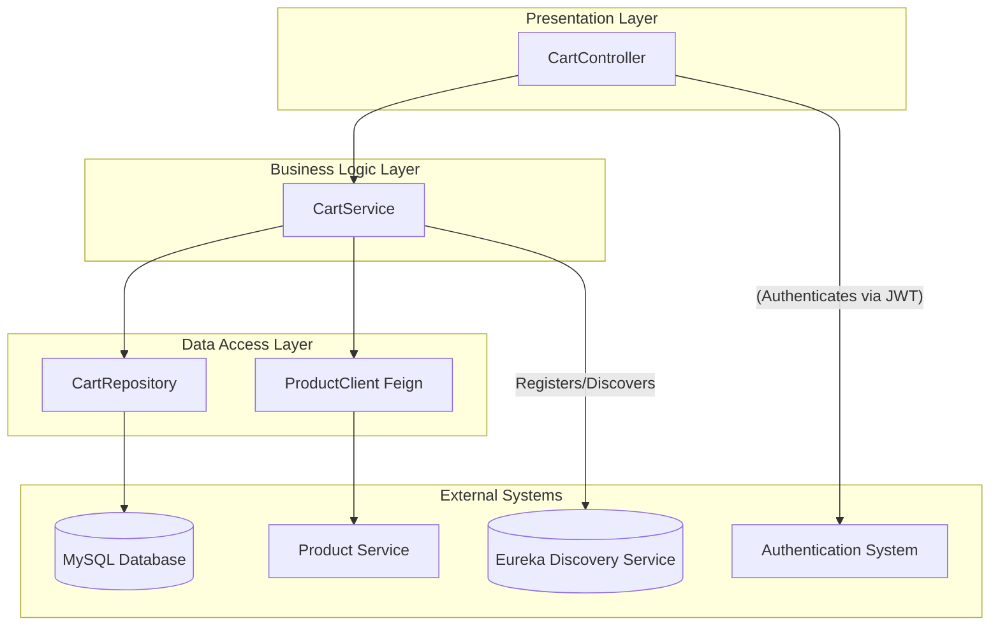
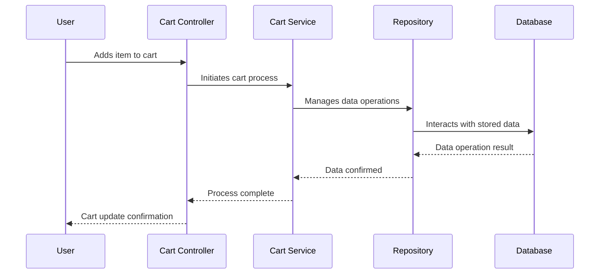

# Shopping Cart Module

# Table of Contents

1. [Module Overview](#1-module-overview)  
2. [Deployment Steps](#2-deployment-steps)  
3. [Component Diagram](#3-component-diagram)  
4. [Flow Diagram](#4-flow-diagram) 
5. [Controller Endpoints and Their Functions](#5-controller-endpoints-and-their-functions)  
   5.1. [Add to Cart](#51-add-to-cart)  
   5.2. [Remove from Cart](#52-remove-from-cart)  
   5.3. [View Cart](#53-view-cart)  
   5.4. [Get Cart Summary](#54-get-cart-summary)  
   5.5. [Clear Cart](#55-clear-cart)  
   5.6. [Update Cart Item Quantity](#56-update-cart-item-quantity)  
   5.7. [Remove Cart Items by Product](#57-remove-cart-items-by-product)
   
6. [Tables](#6-tables)  
   6.1. [Cart Item Table](#61-cart-item-table)  
   6.2. [Users Table](#62-users-table)  
   6.3. [User roles Table](#63-user-roles-table)  
   6.4. [Product Table](#64-product-table)  
   
8. [File Structure](#7-file-structure)

## 1. Module Overview
The **Shopping Cart Module** is a key component of the E-Commerce application that provides functionality for managing a user's shopping cart. It allows users to:
 
- Add products to their cart.
- View the items in their cart.
- Remove items from their cart.
- Calculate the total price of items in their cart.
 
This module interacts with the `Product` and `User` modules to fetch product details and associate cart items with users. It is built using **Spring Boot**, **Spring Data JPA**, and an **H2 in-memory database** for development and testing. The module also integrates with **Spring Cloud Netflix Eureka** for service discovery and **Springdoc OpenAPI** for API documentation.

## 2. Deployment Steps

1. **Clone the project**
   Run the following command to build the project:  
    ```bash
    git clone https://github.com/ACHYUTH-S-11/E_Commerce.git
    ```
3. **Build the Project**  
    Run the following command to build the project:  
    ```bash
    mvn clean install
    ```
 
4. **Run the Application Locally**  
    Execute the following command to start the service locally:  
    ```bash
    mvn spring-boot:run
    ```
 
## 3. Component Diagram
 
This diagram illustrates the high-level relationships and interactions between the main components of the application.
 

## 4. Flow Diagram
 

 
The Shopping Cart Module follows a **layered architecture** to ensure separation of concerns and maintainability:
 
1. **Controller Layer**:
   - Handles HTTP requests and responses.
   - Contains REST endpoints for cart operations such as adding items, viewing the cart, and removing items.
 
2. **Service Layer**:
   - Contains the business logic for managing the shopping cart.
   - Handles operations like adding products to the cart, calculating total prices, and interacting with repositories.
 
3. **Repository Layer**:
   - Interacts with the database using Spring Data JPA.
   - Manages CRUD operations for entities like `Cart_item` `Product`, and `Users`.
 
4. **Model Layer**:
   - Defines the entities (`Cart_item`, `Product`, `Users`) and their relationships.
   - Represents the database tables and their mappings.
 
 
## 5. Controller Endpoints and Their Functions
 
### 5.1 **Add to Cart**
- **Endpoint**: `/api/cart/add`
- **Method**: `POST`
- **Function**: Adds a product to the user's cart. If the product already exists in the cart, it updates the quantity and total price.
 
### 5.2 **Remove from Cart**
- **Endpoint**: `/api/cart/remove/{cartItemId}`
- **Method**: `DELETE`
- **Function**: Removes a specific item from the user's cart based on the cart item ID.
 
### 5.3 **View Cart**
- **Endpoint**: `/api/cart/user`
- **Method**: `GET`
- **Function**: Retrieves all items in the cart for the authenticated user based on the token.
 
### 5.4 **Get Cart Summary**
- **Endpoint**: `/api/cart/summary`
- **Method**: `GET`
- **Function**: Calculates and returns the total price, total items, and unique products in the user's cart.
 
### 5.5 **Clear Cart**
- **Endpoint**: `/api/cart/clear`
- **Method**: `DELETE`
- **Function**: Clears all items in the authenticated user's cart.
 
### 5.6 **Update Cart Item Quantity**
- **Endpoint**: `/api/cart/update/{cartItemId}`
- **Method**: `PUT`
- **Function**: Updates the quantity of a specific cart item.
 
### 5.7 **Remove Cart Items by Product**
- **Endpoint**: `/api/cart/remove-by-product/{productId}`
- **Method**: `DELETE`
- **Function**: Removes all cart items associated with a specific product ID.

## 6. Tables
 
### 6.1 Cart Item Table
 
| Column Name | Data Type | Description |
|---|---|---|
| `cart_itemid` | BIGINT | Primary key for the cart item. |
| `user_id` | BIGINT | Foreign key referencing the user who owns this cart item. |
| `product_id` | BIGINT | Foreign key referencing the product added to the cart. |
| `quantity` | INT | The number of units of the product in this cart item. |
| `total_price` | DOUBLE | The calculated total price for this specific cart item (quantity * product price). |

### 6.2 Users Table
 
| Column Name | Data Type | Description |
|---|---|---|
| `user_id` | BIGINT | Primary key for the user. |
| `username` | VARCHAR | Unique username for the user. |
| `password` | VARCHAR | User's password (should be hashed in a real application). |
| `email` | VARCHAR | Unique email address for the user. |
| `first_name` | VARCHAR | User's first name. |
| `last_name` | VARCHAR | User's last name. |

### 6.3 User Roles Table

| Column Name | Data Type | Description |
|---|---|---|
| `user_user_id` | BIGINT | Unique identifier for the user. |
| `roles` | VARCHAR | User's role, can be "ROLE_ADMIN" or "ROLE_USER". |

### 6.4 Product Table
| Column Name | Data Type | Description |
|---|---|---|
| `product_id` | BIGINT | Primary key |
| `category` | VARCHAR | Category of the product |
| `description` | VARCHAR | Detailed description of the product |
| `image_url` | VARCHAR | URL of the product image |
| `name` | VARCHAR | Name of the product |
| `price` | DOUBLE | Price of the product |
| `stock_quantity` | INT | Number of units available in stock |


 
## 7. File Structure
```
cart-service/                   # Shopping Cart Spring Boot application
├── src/
│   ├── main/
│   │   ├── java/com/platform/
│   │   │   ├── CartServiceApplication.java  # Main application class
│   │   │   ├── config/                      # Configuration classes
│   │   │   │   └── SecurityConfig.java      # Security configuration
│   │   │   ├── controller/                  # API endpoints
│   │   │   │   └── CartController.java      # Handles cart-related endpoints
│   │   │   ├── entity/                      # JPA entities
│   │   │   │   └── CartItem.java            # Cart item entity
│   │   │   ├── feign/                       # Feign clients for external services
│   │   │   │   └── ProductClient.java       # Feign client for product service
│   │   │   ├── model/                       # DTOs and models
│   │   │   │   ├── CartItemDTO.java         # Cart item DTO
│   │   │   │   ├── CartItemRequest.java     # Request model for cart item
│   │   │   │   ├── CartSummary.java         # Summary model for cart
│   │   │   │   └── ProductDTO.java          # Product DTO
│   │   │   ├── repository/                  # Data access layer
│   │   │   │   └── CartRepository.java      # Cart item repository
│   │   │   ├── service/                     # Business logic
│   │   │   │   └── CartService.java         # Handles cart operations
│   │   └── resources/
│   │       ├── application.properties       # Application configuration
│   │       └── static/                      # Static resources (if any)
├── test/                                   # Unit tests
│   ├── java/com/platform/
│   │   └── CartServiceApplicationTests.java # Unit tests for the application
├── pom.xml                                 # Maven configuration file

```
